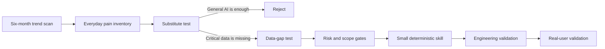

# AI Skill Product Discovery

[](https://github.com/ValerianXXX/ai-skill-product-discovery/actions/workflows/quality.yml)
[](LICENSE)

An evidence-first method for finding everyday consumer tasks that a general AI assistant cannot reliably complete, then turning one into a narrow, auditable AI skill.

The first complete case is [BillFit](cases/billfit/README.md): a local-first skill for supported PG&E residential rate comparison and bill-assistance screening.

## The core question

Do not start with “What can AI summarize?” Start with:

> What useful decision fails because a general model is missing exact, current, local, or user-specific data?

That question led to a stricter opportunity filter:

- the task affects a broad or concentrated user base;
- the outcome changes money, time, access, or eligibility;
- ordinary AI lacks a required fact, rule, compatibility table, or official data snapshot;
- the missing data can be obtained lawfully and maintained;
- a deterministic component can improve reliability;
- the first release can stay narrow and leave irreversible actions to a person.

## Discovery loop



The case preserves rejected ideas and changed decisions. It is a decision record, not a polished origin story written after the product existed.

## BillFit result

| Layer | Current evidence |
|---|---|
| Demand signal | Utility costs and assistance decisions can matter financially; actual willingness to use BillFit is still unproven. |
| General-AI gap | Reliable comparison requires interval usage, exact tariff logic, current official rates, account-scope facts, and explicit unknowns. |
| Product | [BillFit v0.2.0](https://github.com/ValerianXXX/billfit/releases/tag/v0.2.0) |
| Engineering | Deterministic calculator, versioned data, fail-closed exclusions, and automated tests. |
| Distribution | Public GitHub release. OpenAI review or listing is not treated as completed validation here. |
| Market validation | Not yet completed; no product-market-fit, savings, conversion, or retention claim is made. |

Read the [full case](cases/billfit/README.md), the [decision timeline](cases/billfit/discovery-timeline.md), and the [validation ledger](cases/billfit/validation-status.md).

## Reuse the method

1. Follow the [product-discovery framework](methodology/product-discovery-framework.md).
2. Classify sources with the [evidence model](methodology/evidence-model.md).
3. Apply the [critical-data gap test](methodology/critical-data-gap-test.md).
4. Score candidates with the [two-pass scorecard](methodology/scoring-model.md).
5. Keep research, engineering, distribution, and market proof separate with the [validation ladder](methodology/validation-ladder.md).
6. Start a new case from the [case template](templates/case-study-template.md).

Machine-readable examples are in [`data/`](data/README.md). Reusable blank files are in [`templates/`](templates/README.md).

## NeedRadar opportunity handoff

[NeedRadar](https://github.com/ValerianXXX/needradar) can export a published opportunity as `OPPORTUNITY_HANDOFF_V1`. This repository accepts that object as a research input for the general-AI substitute test, critical-data gap test, source review, scoring, and explicit select/reject/defer decision.

The connection is manual and metadata-only: it creates no issue, starts no build, and changes no score automatically. See [`needradar-project.json`](needradar-project.json) for the machine-readable relationship.

## Repository map

```text
methodology/        Reusable discovery and validation method
cases/billfit/      Complete BillFit decision record
data/               Auditable scorecards and evidence ledgers
templates/          Blank files for a new case
scripts/            Repository quality checks
```

## What this repository does not prove

- GitHub popularity is not consumer demand.
- A public repository is not marketplace approval.
- Passing tests is not real-user acceptance.
- A preliminary eligibility screen is not an official decision.
- A modeled rate comparison is not a guaranteed bill saving.

## License and citation

Released under the [MIT License](LICENSE). Academic and professional citations can use [`CITATION.cff`](CITATION.cff).
