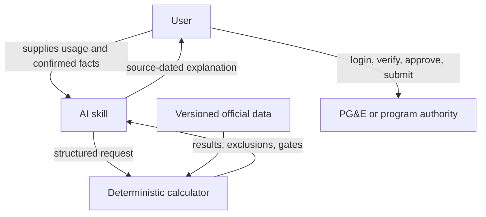

# Product decisions

## Decision record

| Decision | Chosen approach | Rejected alternative | Reason |
|---|---|---|---|
| Product surface | Skill/plugin inside an AI workflow | Standalone consumer app | Reuses an existing conversational interface and keeps the MVP focused on unique data and calculation value |
| Initial scope | One provider: PG&E | National utility coverage | One provider makes exact sources, fixtures, exclusions, and refresh behavior auditable |
| User data | User downloads and supplies Green Button data | BillFit signs in to the utility | Avoids credential handling and keeps account authorization with the user |
| Calculation | Deterministic Python engine | Model performs tariff arithmetic | Exact time buckets, thresholds, and comparisons should be testable and reproducible |
| Source strategy | Versioned official-source snapshots | Search snippets or model memory | Rates and eligibility rules are date-bounded and provider-specific |
| Unknown facts | Explicit human gates | Infer from usage patterns or averages | Baseline territory, technology eligibility, and account configuration materially change validity |
| Failure behavior | Exclude or stop unsupported comparisons | Produce a best-effort universal answer | Solar, CCA, master-metered service, and other cases require logic outside the MVP |
| Eligibility | Preliminary screening | “Approved” or final eligibility | Utilities and practitioners retain the official decision and certification roles |
| External actions | Read and analyze only | Change plans or submit applications | Irreversible or regulated actions require user review and authentication |
| Sensitive material | Do not collect it | Upload proof documents | Initial screening needs household facts, not SSNs, tax returns, pay stubs, or medical records |

## Responsibility split

### AI layer

- identifies the requested decision;
- asks only for facts that change the result;
- routes to the calculator;
- explains outputs and limitations;
- preserves unknowns.

### Deterministic layer

- parses interval files;
- applies rate windows and thresholds;
- ranks calculated plans;
- reconstructs comparable bill components;
- emits structured warnings and human gates.

### Human and authority layer

- authenticates to the utility;
- downloads real usage;
- confirms ambiguous account facts;
- checks the current controlling tariff;
- changes a plan or submits an application;
- provides required practitioner certification.

## Maintenance decision

Dynamic data must carry an effective date, verification date, source URL, and version identifier. A tariff older than the allowed freshness window should trigger a recheck before the user acts. Source refresh is part of the product, not an optional research task.
